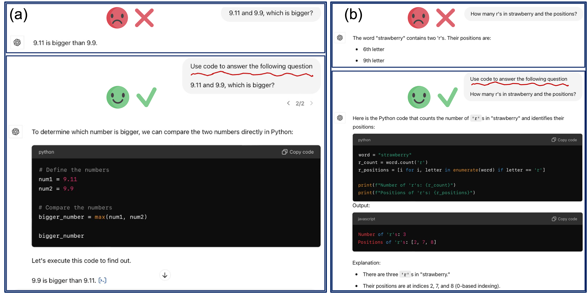
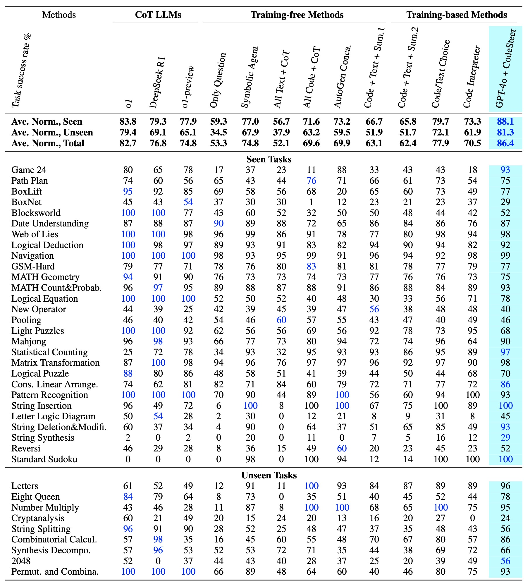

# CodeSteer: Symbolic-Augmented Language Models via Code/Text Guidance
The synthesized dataset for fine-tuning SFT and DPO are in finetune_dataset dictionary.

The synthesized question dataset for 37 tasks are in dataset_gather dictionary.

## Framework


<p align="center" style="font-size: 16px;">
Figure: CodeSteer on guiding LLM code/text generation to integrate symbolic computing. At each interaction with TaskLLM, it reviews current and previous answers, then provides guidance for the next round.
</p>


### Rollout Phase
During rollout, we have two types of tokens
* **Environment tokens** (shown in blue): Generated by the simulator/env, including states $s$ and rewards $r$
* **LLM-generated tokens** (shown in red): Including both thinking tokens $t$ and action tokens $a$

The input consists of a sequence $s_0,A_0,r_0...s_t$, and the output is $A_t$, which contains both thinking $t_t$ and answer $a_t$, where only $a_t$ will be sent to the simulator. While the LLM could potentially generate the entire trajectory given the current state and history trajectory information, we implement a forced truncation after the first generated answer.

The process flow is as follows:
* Given $s_0,A_0,r_0,s_1..s_t$, the LLM tries to generate $A_t,s_{t+1}...s_k$
* A forced truncation is performed to get $A_t$, which contains reasoning (`<think>...</think>`) and answer (`<ans>...</ans>`)
* $a_t$ is extracted from $A_t$ and fed into the simulator to obtain $r_t$ and $s_{t+1}$
* $A_t$, $r_t$ and $s_{t+1}$ are appended to the existing trajectory to form the new input
* After $k$ rounds of rollout, obtaining the sequence $s_0,A_0,r_0,s_1...s_k$ to train the model
* Rollouts are Generated in batch


### Update Phase
During the update phase:
* Compute and back propagate loss for the tokens in orange
* Reward calculation: parsing $r_0,...r_{k-1}$ from the trajectory tokens using regex-based rules
* Final reward computation: $r = {\rm sum}(r_0,...r_{k-1})$ for each rollout generated


### Inspirations

<p align="center" style="font-size: 16px;">
Figure: For many tasks, symbolic computing via coding is much simpler than direct textual reasoning.
</p>


## Performance

We compare GPT-4o + CodeSteer with OpenAI o1 and DeepSeek R1 on SymBench, with 28 seen tasks and 9 unseen tasks.



The cost of tokens and runtimes for each method are as follows.


## Environment Setup
The fine-tuning and inference of CodeSteerLLM is based on [Llama-factory](https://github.com/hiyouga/LLaMA-Factory).
```
git clone git@github.com:yongchao98/CodeSteer-v1.0.git
cd CodeSteer-v1.0

conda create -n CodeSteer python=3.10
conda activate CodeSteer
pip install accelerate==1.0.1
pip install sympy
pip install python-constraint
pip install pandas
pip install anthropic
pip install mistralai
pip install openai
pip install tiktoken
pip install python-dotenv
pip install datasets==3.1.0
pip install peft==0.12.0
pip install trl==0.9.6
pip install transformers==4.46.1
```

## LLM API Key Setup
If you want to use several API-based LLMs as TaskLLM or CodeSteerLLM, then you need to set up API key.

1. First, create a .env file in your project root:
```
OPENAI_API_KEY='your_key_here'
CLAUDE_API_KEY='your_key_here'
MIXTRAL_API_KEY='your_key_here'
DEEPSEEK_API_KEY='your_key_here'
```
2. Add this .env file to your .gitignore to prevent accidentally committing it:
```
echo ".env" >> .gitignore
```

## Train Models

### Create test samples

On the [Gym-Sokoban](https://github.com/mpSchrader/gym-sokoban) task, We create 10k first-round-observation data for training and run for <=1 epoch.
```bash
# sokoban env settings. will determine game difficulty
# it's normal to see some SOKOBAN errors, but the data will be created and it's fine

export DIM_X=6
export DIM_Y=6
export NUM_BOXES=1
export MAX_STEPS=5
export SEARCH_DEPTH=30


python scripts/dataset_curation.py \
    --output data/sokoban \
    --seed 10000 \
    --train_size 10000 \
    --test_size 10 \
    --prefix qwen-instruct # we find it could work for base models
```

### Export variables and train
```bash
export DATA_DIR=data/sokoban
export DIM_X=6
export DIM_Y=6
export NUM_BOXES=1
export MAX_STEPS=5
export SEARCH_DEPTH=30

# export CUDA_VISIBLE_DEVICES=0
# export BASE_MODEL=Qwen/Qwen2.5-0.5B
# export EXPERIMENT_NAME=test-qwen2.5-0.5b

export CUDA_VISIBLE_DEVICES=0
export BASE_MODEL=checkpoints/Agent-R1/test-qwen2.5-0.5b-instruct-1mbsz/actor/global_step_100
export EXPERIMENT_NAME=test-qwen2.5-0.5b-imagetest


export MICRO_BATCH_SIZE=1
export TRAIN_BATCH_SIZE=128 # 256
export PPO_BATCH_SIZE=64 # 128
export MAX_START_LENGTH=400 # the first round prompt max length
export MAX_RESPONSE_LENGTH=100
export MAX_OBS_LENGTH=120
export MAX_TURNS=5
export NUM_UPDATE_PER_ROLL=1 # roll out for a batch, then the model do N times of update. Currently not implemented.
export LOG_MODE="['wandb']" # or 'console'

export GCP=True # gradient checkpointing
export N_GPUS=1
export ROLLOUT_TP_SIZE=1

bash ./train.sh # more arguments in this file

# default config file is verl/trainer/config/ppo_trainer.yaml

```

## Feedback

We welcome all sorts of feedback! Please just raise an issue, no matter if it's any bugs you find or specific questions / suggestions regarding the project.

## Assistance

Contacting [Yongchao Chen](https://yongchao98.github.io/YongchaoChen/) and [Chuchu Fan](https://chuchu.mit.edu) for any questions and discussion.

## Citation
```md
@article{chen2024steering,
  title={Steering Large Language Models between Code Execution and Textual Reasoning},
  author={Chen, Yongchao and Jhamtani, Harsh and Sharma, Srinagesh and Fan, Chuchu and Wang, Chi},
  journal={arXiv preprint arXiv:2410.03524},
  year={2024}
}
```
